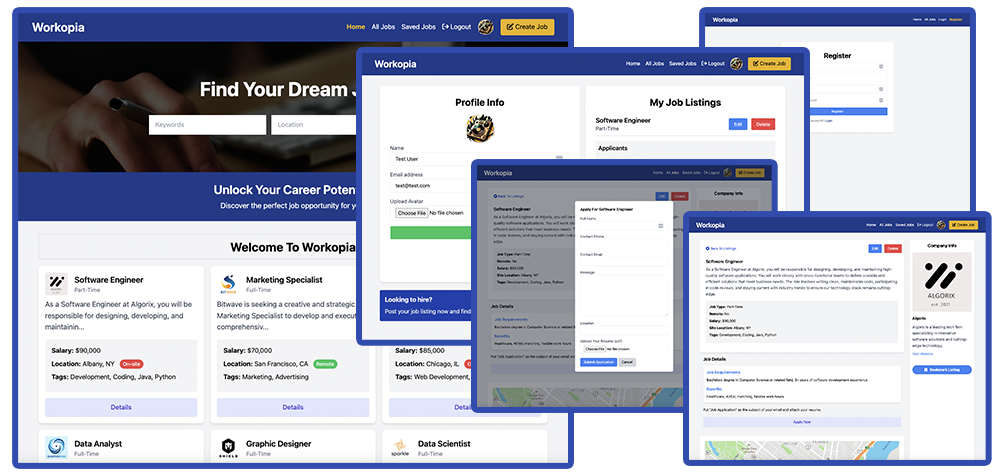

# Workopia (Laravel)

Workopia is a job listing website built with Laravel 11. This is the main project from my Laravel From Scratch course.



## Features

-   Job Listing CRUD
-   Authentication & Authorization Policies
-   Profile Avatar Upload
-   Blade UI Components
-   Vite & Tailwind Integration
-   Bookmarking System
-   Apply & Upload Resume
-   User Dashboard
-   Alpine.js For Interactivity
-   Database Seeder
-   Job Search
-   Mapbox Maps
-   Mailers With Mailtrap
-   Job Listing Pagination

## Usage

#### Install composer dependencies

```
composer install
```

#### Install NPM dependencies and build assets

```
npm install
npm run build
```

#### Add .env Variables

Rename the `.env.example` file to `.env` and add your database values. Change driver and port as needed.

```
DB_CONNECTION=pgsql
DB_HOST=127.0.0.1
DB_PORT=5432
DB_DATABASE=
DB_USERNAME=
DB_PASSWORD=
```

Add your mabox API key:

```
MAPBOX_API_KEY=
```

#### Run Migrations

```
php artisan migrate
```

#### Seed Database (Optional)

You can seed the database with users, jobs and bookmarks

```
php artisan db:seed
```

You will have a test user available with the following credentials:

-   Email: test@test.com
-   Password: 12345678

#### Run Server

If you are using artisan to serve, run the following:

```
php artisan serve
```

Open http://localhost:8000

## License

Workopia has an open-sourced software licensed under the [MIT license](https://opensource.org/licenses/MIT).
